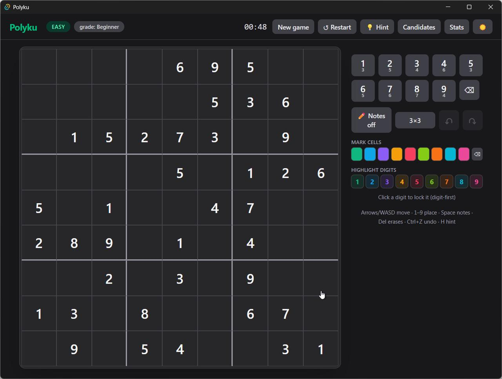
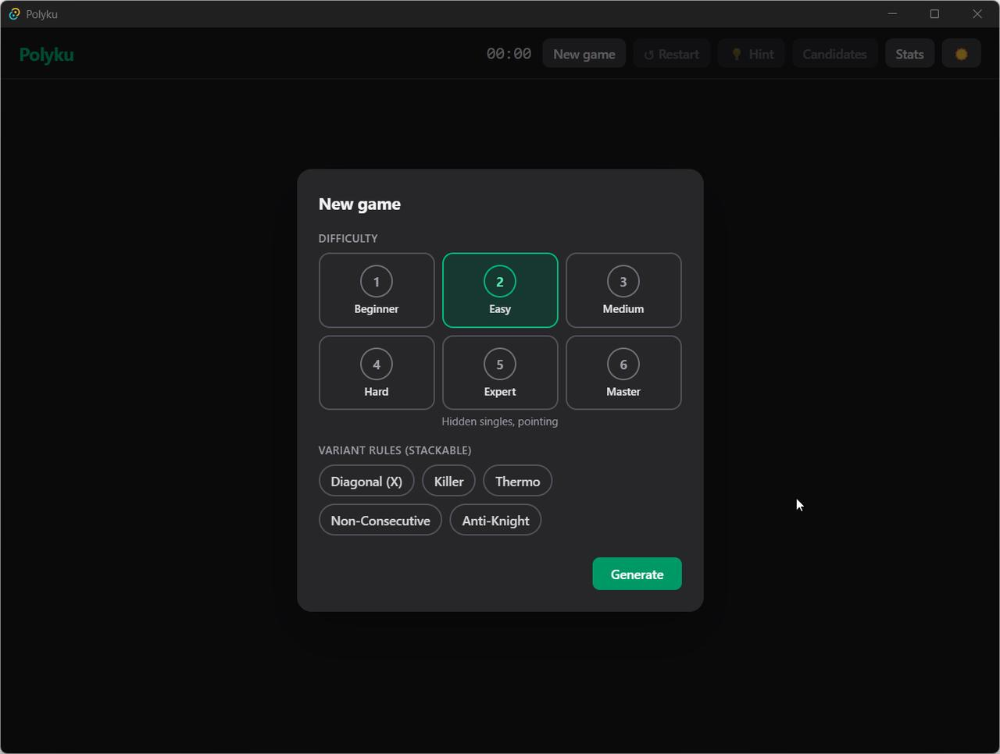

# Polyku

Modern, standalone, offline sudoku for Windows. Every puzzle is freshly
generated on your machine — always unique, always solvable by human logic
alone, never the same twice.



<em>The new-game dialog: six graded tiers and stackable variant rules.</em>



## Why Polyku

- **Procedural generation with proof.** Every puzzle is carved from a random
  solution grid and verified twice: an exact-cover (DLX) solver proves the
  solution is *strictly unique*, and a human-logic deduction engine proves
  it can be finished **without guessing**. Puzzles that fail either check
  are discarded before you ever see them.
- **Honest difficulty.** Six tiers — Beginner to Master — are graded by the
  *hardest technique a puzzle actually requires* (naked singles → hidden
  singles → pairs/triples → X-Wings → Swordfish/Y-Wings/coloring →
  Jellyfish), not by how many digits are missing.
- **Variant rules you can stack.** Diagonal (X), Killer, Thermo,
  Non-Consecutive and Anti-Knight — combine them freely. Any combination is
  generated, uniqueness-proven and graded like plain sudoku.
- **Hints that teach.** The hint system runs the same technique ladder the
  grader uses: it names the technique, highlights the cells, explains the
  step, and can apply it for you. Made a mess? It points at your wrong
  entries first.
- **Built for comfort.** Pencil marks (3×3 or badge layout), 9-color cell
  marking and digit highlighting, undo/redo, fill-candidates dialog,
  digit-first input lock, full keyboard play, autosave, statistics,
  light/dark themes. Silent by design — no audio, no telemetry, no network.

## Variants

| Rule | Constraint |
| --- | --- |
| Classic | rows, columns and boxes hold 1–9 once |
| Diagonal (X) | both main diagonals too |
| Killer | disjoint cages: digits sum to the cage target, no repeats |
| Thermo | digits strictly increase from bulb to tip |
| Non-Consecutive | orthogonally adjacent cells differ by more than 1 |
| Anti-Knight | cells a knight's move apart differ |

Stack them — Diagonal + Killer generates and grades like anything else.

## Building from source

Prerequisites: [Rust](https://rustup.rs) (stable, MSVC), Node.js 22 LTS.

```sh
npm install
npm run tauri dev     # play it
npm test              # frontend unit tests
cargo test --release  # engine tests incl. uniqueness sweeps
npm run tauri build   # release build
```

## Architecture

```
crates/polyku-engine   pure-Rust engine: grid, DLX solver, generator,
                       deduction ladder, variant rules — no UI code
src-tauri              Tauri v2 host: IPC commands, conflict/hint services,
                       JSON persistence in %LOCALAPPDATA%/Polyku
src                    React 19 + TypeScript + Tailwind frontend
```

The webview never sees the solution: hints and validation are computed in
the host. See [CONTRIBUTING.md](CONTRIBUTING.md) for the tour and how to
add a variant in one file.

## Status

🚀 v0.1.0 — fully playable, all planned v1 features in.

## Contributing

PRs welcome — especially new variant rules! Start with
[CONTRIBUTING.md](CONTRIBUTING.md).

## License

[MIT](LICENSE)
